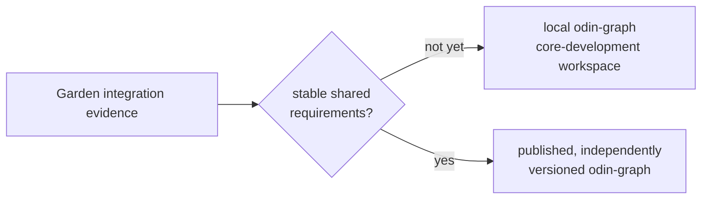

# odin-graph

> Experimental Git repository for the candidate in-memory RDF graph kernel.
> It is not yet published or a runtime dependency of another Odin component.

`odin-graph` is the candidate in-memory RDF graph kernel for the Odin semantic
ecosystem. It will be extracted only from behavior that `odin-rdf`,
`odin-reasoner`, and `odin-sparql` have already proven in integration tests.

The governing ecosystem boundary and extraction gate live in
[`../odin-garden/docs/architecture.md`](../odin-garden/docs/architecture.md).
The decision to defer a published extraction is recorded in
[`../odin-garden/docs/adr/0001-defer-odin-graph.md`](../odin-garden/docs/adr/0001-defer-odin-graph.md).

## Intended scope

The first implementation milestone provides:

- RDF Dataset set semantics across default and named graphs;
- copied/owned RDF values with explicit blank-node identity rules;
- bounded graph-scoped scans without speculative indexes;
- freeze-in-place immutable views suitable for a later public `odin-sparql`
  Dataset adapter;
- documented resource limits, ownership, and error behavior.

## Explicit non-goals

- RDF parsing, writing, or canonicalization;
- SPARQL syntax, algebra, query planning, or result encoding;
- RDFS/OWL rules, inference provenance, or materialization policy;
- persistence, recovery, backup, replication, or network services;
- multi-writer isolation, MVCC, WAL, or a speculative general transaction API.

Durability and operational transaction semantics belong to a future,
independent `odin-store` only when a concrete requirement exists.

## Development plan

The staged work and acceptance conditions are in [TODO.md](TODO.md). Do not
import it from a component until the Garden integration gate has produced the
required cross-component equivalence evidence.
