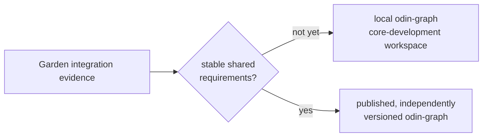

# odin-graph

> Experimental Git repository for the in-memory RDF graph kernel.
> Its `v0.1.0` tag is a Garden-pinned experimental baseline, not a promise of
> an independently supported public API release; the current `odin-sparql`
> development checkout already uses it as `Memory_Dataset` storage.

`odin-graph` is the in-memory RDF graph kernel for the Odin semantic
ecosystem. The scope of any supported external release is extracted only from
behavior that `odin-rdf`, `odin-reasoner`, and `odin-sparql` have proven in
integration tests; development checkouts may integrate it before that scope is
declared stable.



The governing ecosystem boundary and extraction gate live in
[`../odin-garden/docs/architecture.md`](../odin-garden/docs/architecture.md).
The decision to defer a published extraction is recorded in
[`../odin-garden/docs/adr/0001-defer-odin-graph.md`](../odin-garden/docs/adr/0001-defer-odin-graph.md).

## Intended scope

The first implementation milestone provides:

- RDF Dataset set semantics across default and named graphs;
- copied/owned RDF values with explicit blank-node identity rules;
- bounded graph-scoped scans with immutable freeze-time exact, two-term, and
  one-term candidate indexes;
- freeze-in-place immutable views suitable for a later public `odin-sparql`
  Dataset adapter;
- documented resource limits, ownership, and error behavior.

## Explicit non-goals

- RDF parsing, writing, or canonicalization;
- SPARQL syntax, algebra, query planning, or result encoding;
- RDFS/OWL rules, inference provenance, or materialization policy;
- persistence, recovery, backup, replication, or network services;
- multi-writer isolation, MVCC, WAL, or a speculative general transaction API.

Durability and operational transaction semantics belong to a future,
independent `odin-store` only when a concrete requirement exists.

## Development plan

The staged work and acceptance conditions are in [TODO.md](TODO.md). Do not
publish it as a component dependency until the Garden integration gate has
produced the required cross-component equivalence evidence.

## Local verification

With `odin-rdf` checked out beside this repository at the release pinned by
Garden, run:

```sh
odin test graph -collection:odin-rdf=../odin-rdf
```

The optional SPARQL adapter is separate from the kernel and can be verified
against the adjacent SPARQL development checkout with:

```sh
odin test adapter/sparql -collection:odin-rdf=../odin-rdf -collection:odin-sparql=../odin-sparql
```

The separate Reasoner closure importer is a copying migration prototype. It
retains each fact's asserted/inferred first origin, but not the Store's native
term/fact IDs or its inference engine. Its optional derivation-aware entry
also retains opaque rule IDs and first-support Graph indexes. Test it against
the pinned Reasoner revision with:

```sh
odin test adapter/reasoner -collection:odin-rdf=../odin-rdf -collection:odin-reasoner=../odin-reasoner
```

For development across the adjacent working trees, run:

```sh
sh scripts/verify-current-convergence.sh
```

It prints the exact checked-out revisions and runs the Graph kernel, both
adapters, the bounded OWL RL W3C-evidence suite, and Garden's current-source
integration packages. This is migration evidence only: it intentionally does
not replace Garden's release-qualified, fixed-revision verification command.

To additionally run SPARQL's full pinned W3C suites and its 50,000-case fuzz
gate through the same local Graph checkout, use:

```sh
ODIN_GRAPH_FULL_CONFORMANCE=1 sh scripts/verify-current-convergence.sh
```

This is deliberately opt-in: it is a broader conformance run, not the fast
development loop. SPARQL's W3C runners cache their compiled executables in
`$ODIN_SPARQL_COLLECTION/.cache`, so that directory must be writable for the
full mode; normal convergence writes only `odin-graph/.tmp`.
